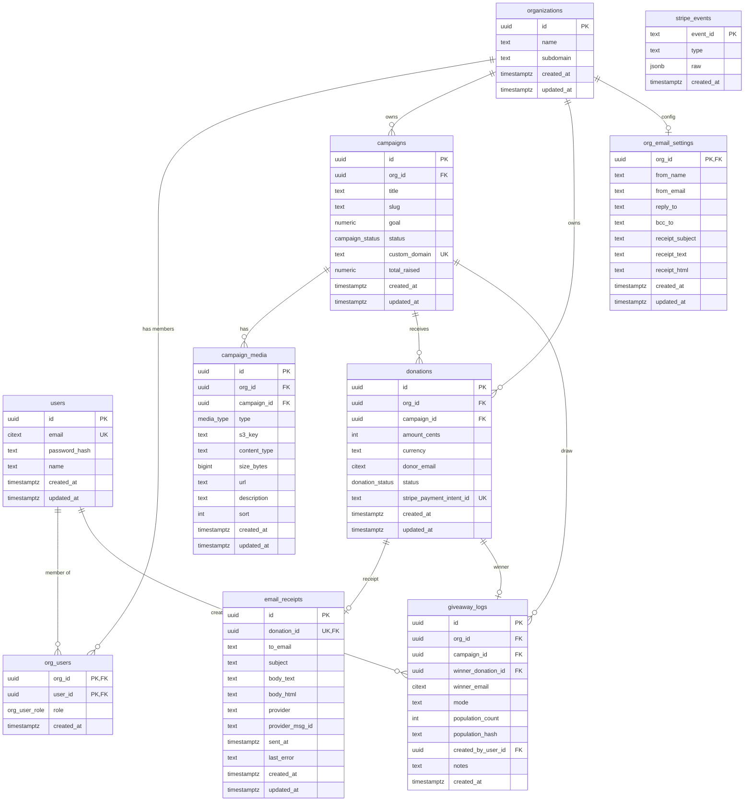

# Entity-Relationship Diagram

## Overview

This document describes the database schema for the Donations Platform.

## Mermaid ER Diagram

## Enums

| Enum | Values |
|------|--------|
| org_user_role | owner, admin, member |
| campaign_status | draft, active, paused, completed, archived |
| donation_status | initiated, requires_payment, processing, succeeded, failed, refunded, canceled |
| media_type | image, video, doc, other |

## Table Descriptions

| Table | Purpose |
|-------|---------|
| organizations | Campaign-creating entities (nonprofits, teams) |
| users | Authenticated users |
| org_users | Membership with role (owner/admin/member) |
| campaigns | Fundraising campaigns with goal, status, slug |
| campaign_media | Media attachments (images, videos, docs) per campaign |
| donations | Individual donations linked to campaign and Stripe |
| email_receipts | Stored receipt content; one per donation |
| giveaway_logs | Audit log for random draws among donors |
| stripe_events | Deduplicated webhook events |
| org_email_settings | Per-org email templates and sender config |
